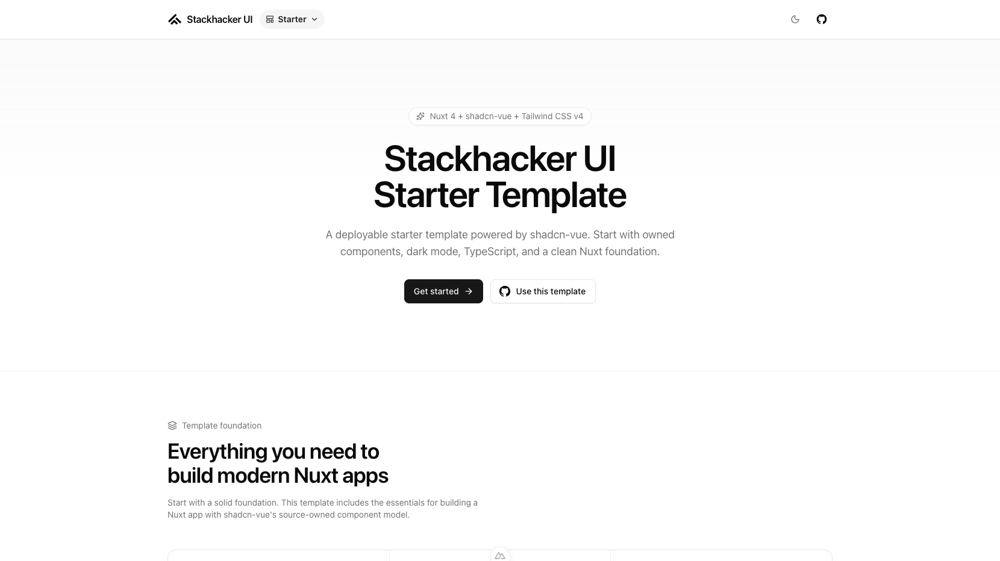

# Stackhacker UI Starter Template

[](https://ui.stackhacker.io)

Use this template to get started with [Stackhacker UI](https://ui.stackhacker.io) quickly.

- [Live demo](https://starter-template.stackhacker.io/)
- [Documentation](https://ui.stackhacker.io/docs/getting-started)

<a href="https://starter-template.stackhacker.io/" target="_blank">
  <picture>
    <source media="(prefers-color-scheme: dark)" srcset="public/screenshots/starter-dark.png">
    <source media="(prefers-color-scheme: light)" srcset="public/screenshots/starter-light.png">
    
  </picture>
</a>

## Quick Start

```bash [Terminal]
pnpm dlx nuxi@latest init my-app -t gh:stackhacker-ui/starter
```

## Deploy your own

[](https://vercel.com/new/clone?repository-name=starter&repository-url=https%3A%2F%2Fgithub.com%2Fstackhacker-ui%2Fstarter&demo-image=https%3A%2F%2Fraw.githubusercontent.com%2Fstackhacker-ui%2Fstarter%2Fmain%2Fpublic%2Fscreenshots%2Fstarter-dark.png&demo-url=https%3A%2F%2Fstarter-template.stackhacker.io%2F&demo-title=Stackhacker%20UI%20Starter%20Template&demo-description=A%20minimal%20template%20to%20get%20started%20with%20Stackhacker%20UI.)

## Setup

Make sure to install the dependencies:

```bash
pnpm install
```

This template is verified with Node.js 22 and pnpm 10.

Set `NUXT_PUBLIC_SITE_URL` in production if you want social previews to use your own deployed URL.

## Development Server

Start the development server on `http://localhost:3000`:

```bash
pnpm dev
```

## Production

Run the quality checks:

```bash
pnpm lint
pnpm typecheck
```

Build the application for production:

```bash
pnpm build
```

Locally preview production build:

```bash
pnpm preview
```

Check out the [deployment documentation](https://nuxt.com/docs/getting-started/deployment) for more information.

## Renovate integration

Install [Renovate GitHub app](https://github.com/apps/renovate/installations/select_target) on your repository and you are good to go.
